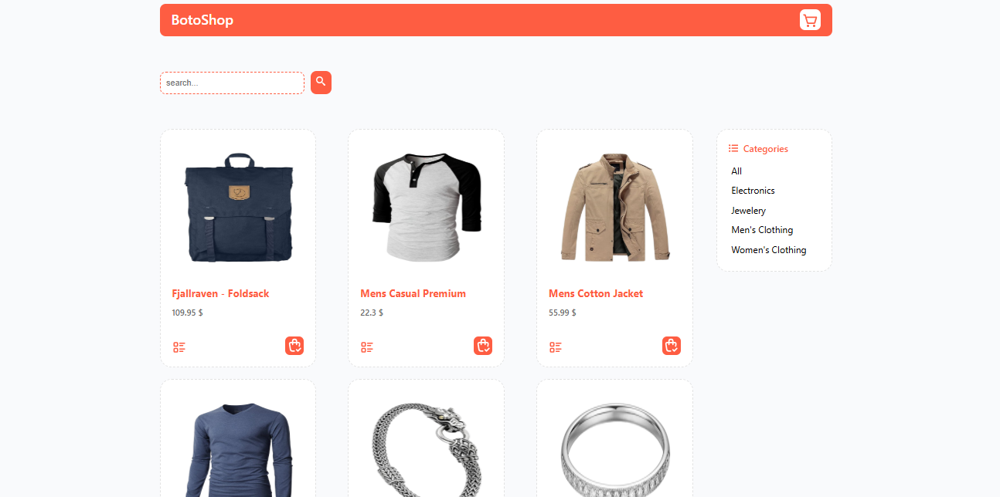
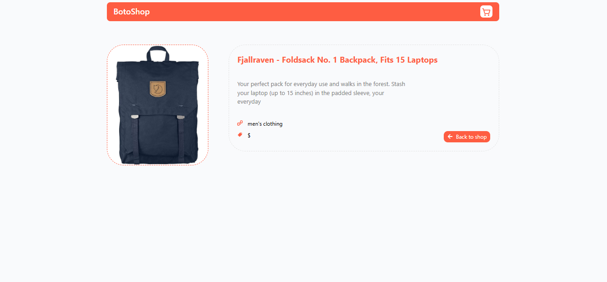
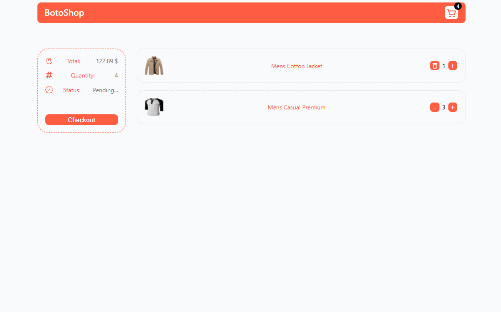

🛍️ Store Project

A simple and modern **E-commerce web application** built with **React, JavaScript, HTML, CSS, and Vite**.  
This project fetches product data from [Fake Store API](https://fakestoreapi.com/) and allows users to **search, filter, view details, and manage a shopping cart**.

---

 🚀 Features

- Fetches and displays products from **Fake Store API**
- **Search** products by name or category
- **Filter** products by category
- **View product details** on a separate page
- **Shopping cart** with:
  - Add product to cart  
  - Increase or decrease product quantity  
  - Remove items from cart  
- **404 Page** for invalid routes
- **Responsive design** (works on mobile and desktop)

---

 🧩 Tech Stack

| Technology | Description |
|-------------|-------------|
| [React](https://react.dev/) | Frontend library for building the UI |
| [Vite](https://vitejs.dev/) | Fast development and build tool |
| JavaScript (ES6+) | Core programming language |
| HTML / CSS | Structure and styling |
| [Fake Store API](https://fakestoreapi.com/) | Data source for products |

---

⚙️ Installation & Setup

 1️⃣ Clone the repository
```bash
git clone https://github.com/H-ooman/store-project.git

2️⃣ Navigate into the project folder

cd store-project

3️⃣ Install dependencies

npm install

4️⃣ Start the development server

npm run dev

5️⃣ Build for production

npm run build

🖼️ Pages Overview

| Page               | Description                                                |
| ------------------ | ---------------------------------------------------------- |
| 🏠 Home            | Displays all products with search and filter functionality |
| 📦 Product Details | Shows detailed information for a selected product          |
| 🛒 Cart            | Displays selected items and allows quantity adjustments    |
| ⚠️ 404             | Shown for any invalid route                                |


🖼️ Screenshots






🌐 API Used

fetch('https://fakestoreapi.com/products')
  .then(res => res.json())
  .then(data => console.log(data));


🧑‍💻 Developer

Hooman Sedaghat
📧 Email: hoomansedaghat9@gmial.com

🌐 GitHub: @H-ooman
